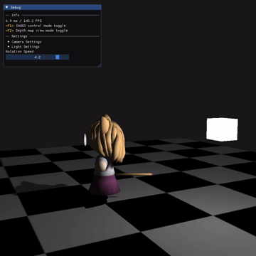

# Simple OpenGL 3D program

You can adjust the light's position and color in this 3D scene and fly around inside the scene. Educational purpose only.

## 🎮&#xFE0F; Controls
- <kbd>WASD</kbd> and Mouse : move around
- <kbd>Left Control</kbd> : descend
- <kbd>Space</kbd> : ascend
- <kbd>F1</kbd> : toggle between ImGUI window and scene.
- <kbd>F2</kbd> : toggle between light's depth map and scene.
- <kbd>F5</kbd> : reload `shader.vert, shader.frag` and recompile that shdaer program.

## ⚠&#xFE0F; Important Stuffs
- You need to provide your local version of `vcpkg.cmake` and replace the path of `CMAKE_TOOLCHAIN_FILE` in `CMakePresets.json`
- Uses `cl.exe` for compiler (Visual C++)
- I worked with Visual Studio Code's CMake extension and stuffs. They are pretty handy since they let you interact with CMake project with GUI. Following are extensions in Visual Studio Code.
    - `CMake`
    - `CMake Language Support`
    - `CMake Tools`
    - `C/C++ Extension Pack`

## ✔&#xFE0F; Things used in this project
- [sketchfab - neco arc 3D model](https://sketchfab.com/3d-models/neco-arc-8bcd385adec44fdf8ebfc63bcdf5b28c)
- [glm](https://github.com/g-truc/glm): OpenGL Mathematics
- [gl3w](https://github.com/skaslev/gl3w): OpenGL profile loader
- [GLFW](https://www.glfw.org/): OpenGL library
- [fmt](https://github.com/fmtlib/fmt): formatting library
- [stb](https://github.com/nothings/stb): `stb_image.h` is used for image loading function
- [assimp](https://github.com/assimp/assimp): model loader
- [Dear ImGUI](https://github.com/ocornut/imgui): GUI library for C++
- CMake for C++ project, vcpkg for managing libraries.